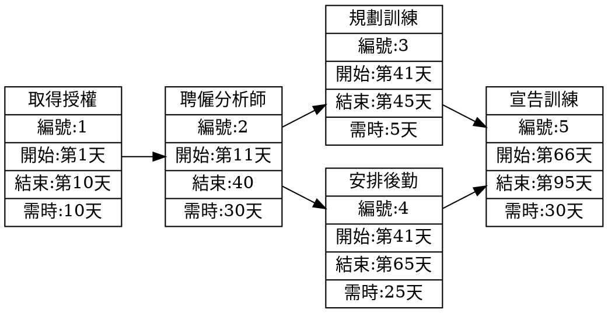

| 任務  |      說明      | 需時  | 前置  |
| :---: | :------------: | :---: | :---: |
|   1   |    研擬計畫    |   1   |   -   |
|   2   |    任務分配    |   4   |   1   |
|   3   |    取得硬體    |  17   |   1   |
|   4   |    程式開發    |  70   |   2   |
|   5   |    安裝硬體    |  10   |   3   |
|   6   |    程式測試    |  30   |   4   |
|   7   | 選寫使用者手冊 |  25   |   5   |
|   8   |    轉換檔案    |  20   |   5   |
|   9   |    系統測試    |  25   |   6   |
|  10   |   使用者訓練   |  20   |  7,8  |
|  11   |   使用者測試   |  25   | 9,10  |

